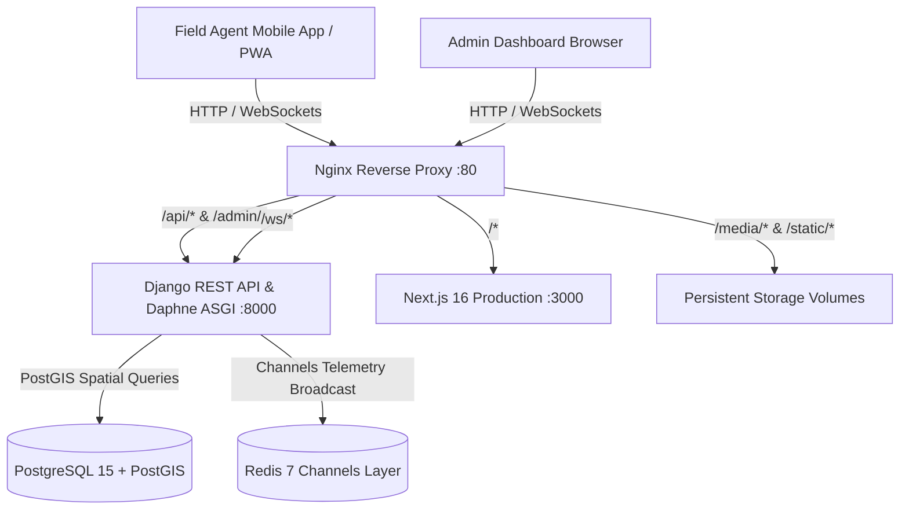

# AgentPulse HQ - Field Agent Tracking & Management System

[](https://www.djangoproject.com/)
[](https://nextjs.org/)
[](https://postgis.net/)
[](https://redis.io/)
[](https://www.docker.com/)

AgentPulse HQ is an enterprise-grade Field Agent Tracking, Geofence Verification, and Visit Intelligence platform. It combines a mobile-first Progressive Web App (PWA) for field agents with a real-time command center for dispatchers and administrators.

---

## Key Features

### 1. Field Agent Mobile App (`/agent`)
- **One-Handed Mobile Operation:** High-contrast touch targets ($\ge 48\text{px}$ to $52\text{px}$ height) engineered for outdoor daylight legibility.
- **Guided 4-Stage State Card Flow:**
  1. **Stage 1 (En Route):** Large, prominent $52\text{px}$ `ON DUTY` toggle switch with immediate feedback (`● ON DUTY` / `○ OFF DUTY`), target store selector, and distance indicator to client location (`450 meters away`).
  2. **Stage 2 (Arrival $<50\text{m}$):** High-visibility green pulse banner (`● Within 50m of Client - GEOFENCE OK`) with single-tap `📷 Take Live Selfie & Punch In`. Automatically generates an memory-safe canvas watermark stamped with coordinates, timestamp, client name, and agent ID.
  3. **Stage 3 (In-Store Meeting):** High-visibility dark card displaying a live meeting stopwatch widget (`00:14:22`) and in-store meeting status.
  4. **Stage 4 (Gated Punch-Out & Quick Tags):** Clean discussion notes input with single-tap quick-tag pills (`#OrderPlaced`, `#FollowUpNeeded`, `#PaymentCollected`, `#StockAudited`, `#ClientSatisfied`). The Punch-Out button dynamically unlocks only when notes are present.
- **Offline & Connectivity Feedback:** Subtle top banner: `"⚡ Offline Mode: Records saved locally, auto-syncing when online"` with live IndexedDB queued records indicator.
- **PWA Ready:** Installable directly to mobile home screens with custom app icons, standalone portrait mode, and quick-action shortcuts.

### 2. Admin Command Center (`/`, `/analytics`, `/replay`)
- **Live Fleet Map (`/`):**
  - Animated, color-coded status rings:
    - 🟢 **Green Pulse (`ring-pulse-green`):** Active In-Store Meeting (`CHECKED_IN`)
    - 🔵 **Blue Ring (`ring-blue-transit`):** In Transit / Moving (`MOVING`)
    - ⚪ **Gray Ring (`ring-gray-idle`):** Off Duty / Idle
  - **Instant Hover Tooltip:** Displays Agent Name, Battery % (`🔋`), Speed, and current activity status on mouse hover.
  - **Watermark-Free Mapping:** Clean OpenStreetMap tiles with no third-party API key warnings.
- **Side-by-Side Audit Modal (`/analytics`):**
  - **Left Column:** Full high-resolution preview of the watermarked selfie proof with geofence stamp.
  - **Right Column:** Clean metadata summary cards for Time In, Time Out, Total Duration, Client Details ($<50\text{m}$ geofence verification), Discussion Notes with tag highlights, and Order Value Secured.
- **Smooth Route Replay HUD (`/replay`):** Media-player control bar (`Play`, `Pause`, `Reset`, `1x`, `2x`, `5x`, `10x`) with automatic smooth map tracking (`map.panTo`) following the moving agent.

---

## Architecture & Technology Stack



- **Backend:** Python 3.11, Django 5.0, Django REST Framework, Django Channels 4, Daphne ASGI
- **Database & Cache:** PostgreSQL 15 with PostGIS spatial extension, Redis 7 (Channel layer)
- **Frontend:** Next.js 16 (App Router, Turbopack), React 19, Tailwind CSS v4, Leaflet.js
- **Reverse Proxy & Web Server:** Nginx (Alpine) with HTTP/1.1 WebSocket upgrades
- **PWA:** Web App Manifest (`manifest.json`), Service Worker / IndexedDB offline queue

---

## Quickstart with Docker Compose (Recommended)

### 1. Clone the repository
```bash
git clone https://github.com/your-org/AgentPulse-HQ.git
cd AgentPulse-HQ
```

### 2. Configure Environment Variables
Copy the template configuration:
```bash
cp .env.example .env
```
*(Optional: customize passwords or ports inside `.env`)*

### 3. Launch the Complete Fleet
```bash
docker compose up -d --build
```

The container stack will automatically:
1. Initialize the **PostGIS** database container.
2. Initialize the **Redis** broker container.
3. Run Django database migrations (`python manage.py migrate`).
4. Collect static files (`python manage.py collectstatic`).
5. Seed initial field agents, client stores, and route breadcrumbs (`python seed_data.py`).
6. Launch Daphne ASGI on port 8000.
7. Build and run the **Next.js** frontend on port 3000.
8. Start **Nginx** reverse proxy on port 80.

### 4. Access the Platform
- **Unified Login Portal:** [http://localhost/login](http://localhost/login) (or `http://localhost:3000/login`)
- **Admin Command Center:** [http://localhost](http://localhost) (or `http://localhost:3000`)
- **Field Agent Mobile App:** [http://localhost/agent](http://localhost/agent) (or `http://localhost:3000/agent`)
- **Performance Analytics & Audits:** [http://localhost/analytics](http://localhost/analytics)
- **Interactive Route Replay:** [http://localhost/replay](http://localhost/replay)
- **Django REST API / Admin:** [http://localhost/api/](http://localhost/api/) and [http://localhost/admin/](http://localhost/admin/)

### 5. Default Credentials & Roles
| Role | Username / ID | Password | Access Rights |
| :--- | :--- | :--- | :--- |
| **HQ Administrator** | `admin` | `AdminPassword123!` | Full live radar, route replay, analytics audit, agent creation, and Django Admin. |
| **Field Agent 1** | `agent_sarah` *(or `AGT-101`)* | `AgentPassword123!` | Mobile GPS shift toggle, 50m geofenced selfie punch-in, meeting timer, notes. |
| **Field Agent 2** | `agent_marcus` *(or `AGT-102`)* | `AgentPassword123!` | Mobile GPS shift toggle, 50m geofenced selfie punch-in, meeting timer, notes. |
| **Field Agent 3** | `agent_elena` *(or `AGT-103`)* | `AgentPassword123!` | Mobile GPS shift toggle, 50m geofenced selfie punch-in, meeting timer, notes. |

---

## Local Development (Without Docker)

### Backend Setup
```bash
cd backend
python -m venv venv
# Windows:
.\venv\Scripts\activate
# Linux/macOS:
source venv/bin/activate

pip install -r requirements.txt

# Run migrations & seed data
python manage.py migrate
python seed_data.py

# Run ASGI server with WebSockets
python manage.py runserver 0.0.0.0:8000
```

### Frontend Setup
```bash
cd frontend
npm install
npm run dev
# Frontend runs on http://localhost:3000
```

---

## Running Automated Tests

### Backend Unit Tests
Execute the comprehensive test suite covering server-side geofencing, duty status, check-in validation, and checkout gates:
```bash
# Inside backend directory or container:
python manage.py test tracking
```
*Expected result:*
```text
Found 7 test(s).
Creating test database for alias 'default'...
System check identified no issues (0 silenced).
.......
----------------------------------------------------------------------
Ran 7 tests in 0.128s

OK
```

### Frontend Build Verification
Validate that all TypeScript types, PWA manifests, and Next.js routes compile cleanly:
```bash
cd frontend
npm run build
```
*Expected result:*
```text
✓ Compiled successfully
✓ Finished TypeScript check with 0 errors
✓ Generating static pages (7/7)
Route (app)
┌ ○ /
├ ○ /_not-found
├ ○ /agent
├ ○ /analytics
└ ○ /replay
```

---

## Production VPS Deployment Guide (Ubuntu 22.04 / 24.04)

### 1. Server Provisioning & Docker Setup
SSH into your VPS (e.g., DigitalOcean Droplet, AWS EC2, Hetzner Cloud):
```bash
sudo apt update && sudo apt upgrade -y
sudo apt install -y curl git ufw

# Install Docker & Docker Compose plugin
curl -fsSL https://get.docker.com -o get-docker.sh
sudo sh get-docker.sh
sudo usermod -aG docker $USER
```

### 2. Configure Firewall (UFW)
```bash
sudo ufw allow OpenSSH
sudo ufw allow 80/tcp
sudo ufw allow 443/tcp
sudo ufw enable
```

### 3. Deploy Application
```bash
git clone https://github.com/your-org/AgentPulse-HQ.git /opt/agentpulse
cd /opt/agentpulse
cp .env.example .env

# Edit .env with your domain, secure secret key, and DB passwords:
nano .env

# Launch production containers in daemon mode
docker compose up -d --build
```

### 4. Enable Free SSL via Let's Encrypt / Certbot
Install Certbot on the host:
```bash
sudo apt install -y certbot python3-certbot-nginx
```
Configure your domain name in Nginx and obtain a free certificate:
```bash
sudo certbot certonly --standalone -d yourdomain.com -d www.yourdomain.com
```

Update `nginx/default.conf` to listen on port 443 with SSL certificates:
```nginx
server {
    listen 443 ssl http2;
    server_name yourdomain.com;

    ssl_certificate /etc/letsencrypt/live/yourdomain.com/fullchain.pem;
    ssl_certificate_key /etc/letsencrypt/live/yourdomain.com/privkey.pem;
    
    # ... proxy passes same as default.conf ...
}
```

### 5. Production Maintenance & Useful Commands
- **View Live Logs:**
  ```bash
  docker compose logs -f backend
  docker compose logs -f frontend
  ```
- **Restart Services:**
  ```bash
  docker compose restart
  ```
- **Database Backup:**
  ```bash
  docker compose exec db pg_dump -U agentpulse_user agentpulse_db > backup_$(date +%F).sql
  ```

---

## License
Proprietary / Enterprise. All rights reserved. AgentPulse HQ © 2026.
